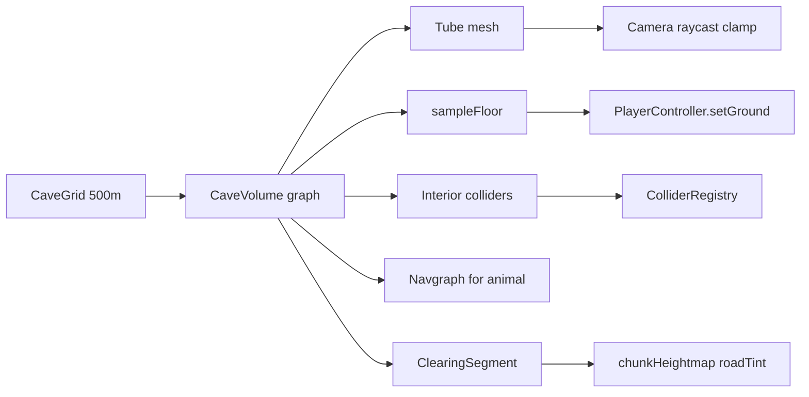

# Plan 104: prawdziwe jaskinie podziemne

**Status:** `planned` 📋 — wstępny plan całości, do review i uzupełnienia (Opus) zanim ktokolwiek zacznie kod.
**Created:** 2026-08-14
**Priority:** 🔴 high · **Effort:** XL (fazy 0–4, kilka sesji; Faza 3 = bramka usera) · **Depends on:** ~~097~~
**Źródła (wiążące):**
- [research 008 — brief](../research/2026-08-13--008--real-caves-in-three-js--brief.md)
- [research 009 — underground caves](../research/2026-08-13--009--underground-caves.md) — zwłaszcza §11 (werdykt po odpowiedziach)
- Physics: [plan 097](./archive/2026-08-13--097--physics-falling-collisions-jumping.md) — **zaimplementowane** (`verification needed`), nie blocker

> **Charakter:** szkic całości (L2-capable `CaveVolume`, v1 = 1 krawędź). Review ma zweryfikować kod wobec tego dokumentu, domknąć §8 albo zostawić jawne ❓, i dopisać implementation notes. **Nie implementować w ramach review.**

---

## 1. Werdykt (zamknięty przez research 009 §11)

| | Decyzja |
|---|---|
| Poziom | **L2** (3–4 korytarze + sala). L3 (biom) poza zakresem. |
| Technika | **B** — osobny mesh wnętrza; heightmapa tylko na ujście. A/F/E odrzucone. C (hole punch) odłożone. D (outcrop) tylko fallback po pomiarze. |
| v1 vs L2 | Jedna abstrakcja od dnia 1: `CaveVolume` jako **graf**. v1 = 1 krawędź. L2 = te same typy, więcej węzłów. |
| Generator | Siatka z jitterem, wzorzec osad: `CAVE_GRID_STEP = 500 m`. Nie globalna lista 10 sitów wokół (0,0). |
| Gęstość (nominalna, przed testem nadkładu) | Duże w górach: `E = 0.60` → ~645 m. Małe poza górami: `E = 0.30` → ~910 m. Cel: ~4 małe + ~2–5 dużych w promieniu 1 km. |
| Zejście | Korytarz **opada ~10–15%** — warunek nadkładu i sali pod łąką. |
| Kolizja | **System 097**, nie osobny `clampToVolume`. Graf zostaje jako mesh / siting / navmesh. |
| Kopanie ścian | Odłożone. Jeśli wróci jako wymaganie → to jest moment na F (woksle), nie doklejanie do B. |
| Wnętrza chat | Nie abstrahować na `InteriorVolume` na zapas. Nazwa `CaveVolume`, API czyste. |
| Fauna-cave | Osobny system na v1. Mała jaskinia **może zastąpić** `createCaveMouth` tam, gdzie siting przejdzie; tam gdzie nie — zostaje fasada. Rozdział nazw: `FaunaDen` vs `CaveVolume`. |
| Zawartość | v1 **niepuste**: zwierzę (wilk) i/lub skarb → persystencja flag. |

Odrzucone false economies (009 §7): kolizja z mesha/BVH, dalsze `modifyTerrain` jako „tunel”, rzeźba wejścia post-hoc, runtime CSG, portal-najpierw.

---

## 2. Stan kodu (2026-08-14) — punkt startu dla review

**Jaskinie dziś to rów, nie wnętrze.** Plan 090 mówi „tunel”; kod robi serię `modifyTerrain` (głębokość ~2.2–2.8 m) + skały. Gracz nigdy nie jest pod dachem.

- Large caves: `src/world/largeCaves.ts`, `src/world/createLargeCaves.ts`, `src/world/largeCaveVisual.ts`. 10 sitów, pierścień 130–620 m, `measureSlope` radius 4 / `drop >= 0.85`. Żyją w `WorldBundle.largeCaves`.
- Fauna den: `src/settlement/props.ts` `createCaveMouth`, `src/fauna/createFauna.ts` — 1 `modifyTerrain`, spawner 25–45 m od osady. Świadomie bez geometrii podziemnej.
- Heightfield: `src/terrain/buildChunkGeometry.ts` — jedna wysokość na (x,z). Dach **musi** być geometrią jaskini.
- `modifyTerrain` jest **po** workerze; trawa/drzewa liczą się w workerze z `roadTint` (`src/terrain/chunkHeightmap.ts` ~600–798). Wejście **musi** iść do world-genu jako `ClearingSegment`, inaczej rów zarasta.
- Siatka osad: `SETTLEMENT_GRID_STEP = 280` + jitter — `src/settlement/settlementGenerator.ts`. To wzorzec generatora jaskiń, nie per-chunk.
- Physics 097: `src/world/collision.ts` — `Collider = {x,z,radius}`, `resolvePosition` **wypycha na zewnątrz**, `ColliderRegistry` z `ownerKey`. `ChunkManager.registerColliders` / `collidersNear`. Gracz: `setGround(sampleHeight, sampleFloor, waterLevel, collidersNear)` w `src/player/PlayerController.ts`. Skok + grawitacja już są.
- **Luka 097 vs jaskinia:** 097 jest 2D circle-push-**out**. Korytarz wymaga ograniczenia **do wewnątrz** objętości. Plan 097 §2.2 świadomie zostawił to temu planowi (implementation notes §4.5: rejestr gotowy na `ownerKey`, zero ścian).
- `AnimalAgent` Y wyłącznie z `sampleHeight` — wilk w jaskini stanąłby na powierzchni nad dachem. Brak `setGround`.
- `PlayerTorch` już istnieje (PointLight + paliwo).
- Kamera: boom 1.6–22, zero collision.



---

## 3. Minimalna abstrakcja

Jeden nowy moduł w `WorldBundle`, **zamiast** dzisiejszego `LargeCaves` (nie obok na stałe — rowy 090 odchodzą gdy siatka działa).

```text
CaveNode   = { id, kind: 'mouth' | 'junction' | 'chamber' | 'dead-end',
               pos: {x, y, z}, radius, height }
CaveEdge   = { from, to, radius, height }
CaveVolume = { id, seed, nodes[], edges[], bounds }
  id stabilny: (gx, gz, index) — nie indeks w globalnej liście
```

API (009 §5): `contains` · `sampleFloor` · `nearestMouth` · `buildMesh` · `carveInputs` → `ClearingSegment[]`.

Kolizja ścian **nie** jest osobnym `clampToVolume` — patrz §4.

v1 = `nodes: [mouth, dead-end], edges: [1]`. Ten sam typ co L2.

---

## 4. Kolizja wnętrza — do domknięcia w review

Nie budować drugiego systemu. Rozszerzyć 097.

**Rekomendacja wstępna (do skrytykowania):** nowy prymityw *interior* w `src/world/collision.ts`, 1:1 z grafem:

- `InteriorCapsule { ax,az, bx,bz, radius }` per krawędź — jeśli entity jest poza kapsułą, wciągnij na najbliższy punkt na odcinku + radius.
- `InteriorDisk { x,z, radius }` per komnata.
- `resolvePosition` najpierw solid-out (drzewa/skały/domy), potem interior-in (jaskinia), gdy gracz/`AnimalAgent` jest w volume (`contains`).

Fałszywa oszczędność: łańcuch kół wzdłuż ścian korytarza. Działa na 1 rurze, rozpada się w komnacie i na rozwidleniu — dokładnie to, czemu 009 odrzucił kolizję z mesha.

Podłoga: nie collider. `sampleFloor` z grafu (interpolacja Y wzdłuż krawędzi / wysokość komnaty). Wejście do volume podmienia provider gracza przez istniejący `setGround()`. Woda: własny `waterLevel` (−Inf albo floor − margin). Siting: `Y_wejścia − zejście > waterLevel + margines`.

Kamera: clamp `look.distance` raycastem **tylko o mesh jaskini** (1 `Raycaster`, 1 mesh). Bez `three-mesh-bvh`. Fallback v1: stały clamp ~3 m.

---

## 5. Fazy (kolejność implementacji)

Physics 097 jest zrobione — **nie** wchodzi do tego planu.

### Faza 0 — Spike sitingu i gęstości (S–M, **przed meshem**)

Skrypt / test (Vitest albo `src/world/caveSiting.spike.ts` odpalany raz), nie feature.

Dla aktualnego seeda zmierzyć:
1. udział terenu górskiego w promieniu 1 km (od tego zależy czy `E = 0.60` daje 2 czy 5 dużych),
2. odsetek komórek siatki 500 m, które przechodzą test nadkładu na korytarzu 20–30 m / spadek 12%,
3. realny odstęp między wejściami **po** odrzuceniach.

Jeśli akceptacja jest bardzo niska → nie pisać mesha. Kalibracja progów albo D (outcrop) na nizinach. Progi z research 009 §11.1a są **nominalne**.

Kryterium „góry”: review ma wskazać konkretny sampler (`sampleMountainRidge` jest już w `createLargeCaves` / `ChunkManager`) i próg. Dziś large caves **odrzucają** `mountainRidge > 0.55` — nowy generator **odwraca** to dla dużych jaskiń.

### Faza 1 — Siting + world-gen (L)

- Generator komórek: `hash(seed, gx, gz)` → kandydat + jitter, analogicznie do `src/settlement/settlementGenerator.ts`.
- Góry → próba dużej (`p(1)=0.50`, `p(2)=0.05`); reszta → próba małej (`p(1)=0.30`); potem test nadkładu.
- Streaming jak osady: komórki w zasięgu gracza, nie 10 sitów przy starcie. Mesh w `WorldBundle`, nie w chunku.
- Ujście jako `ClearingSegment` do `paramsFor` w `src/terrain/chunkManager.ts` obok `village.clearings` — wycina trawę/drzewa/skały wokół **otworu**, nie nad całym tunelem.
- Rampa w terenie: albo clearing z `targetH` / `heightStrength`, albo wąski `modifyTerrain` **tylko** na ujściu (nie na 20 m rowu). Preferować clearing, żeby worker wiedział.
- Omijać wioski / drogi / wybrzeże (reuse `isCoastalPlacement`, `roadCorridorsNear`).
- **Zastąpić** `createLargeCaves` / `pickLargeCaveSites`. Nie trzymać dwóch rodzin „dużych jaskiń”.
- v1 archetyp wejścia: **tylko zbocze**. Zapadlisko (D) tylko jeśli spike pokaże, że niziny bez zbocza zerują małe jaskinie.

### Faza 2 — `CaveVolume` v1: mała jaskinia (XL)

Jeden opadający korytarz 20–30 m, ślepy, przekrój ~3–4 × 2–4 m.

- Graf + `sampleFloor` / `contains` + testy jednostkowe (czysta logika, bez Three).
- Mesh: tuba per krawędź, merge do jednej `BufferGeometry`. Wpuścić 0.5–1 m pod teren; arka/skały z reuse `src/world/largeCaveVisual.ts`.
- Rejestr colliders `ownerKey = cave:{id}` przy stream-in, `clearColliders` przy stream-out.
- `PlayerController.setGround` swap przy wejściu/wyjściu (trigger `nearestMouth` + `contains`).
- Kamera: clamp distance.
- Światło: vertex colors ciemniejące z odległości od mouth; **nie** ściszać globalnego ambientu. Fog override w środku. `PlayerTorch` jako realne źródło.
- AI powierzchniowe: koło wykluczenia wokół mouth (wzorzec `isWithinVillageRadius`). Nad tunelem fauna chodzi normalnie.
- Streaming mesha po odległości; `pinned` raczej zbędny.

### Faza 3 — Weryfikacja w przeglądarce (bramka)

Zatrzymać się. Nie zaczynać L2 ani zawartości, dopóki user nie potwierdzi: szew, ciemność+pochodnia, kamera w korytarzu, gęstość „na oko”, N8AO/godrays/fog. Agent **nie** odpala headless Chrome.

### Faza 4 — Duża jaskinia + zawartość (XL)

Może iść jako ten sam plan (po bramce) albo follow-up — review ma to rozstrzygnąć po Fazie 3; wstępnie **zostaje w 104**, żeby L2 nie dostało osobnego fundamentu.

- Generator: 2–4 krawędzie + 1 komnata, brak samoprzecięć, wspólny profil nadkładu, 1 mouth na v1 (2. wejście = drugi węzeł `mouth`, tanie później).
- Mesh: komnata jako skorupa; korytarze wchodzą z zapasem (ciemno w środku = brak widocznych dziur).
- **Zwierzę:** wilk (brak niedźwiedzia w `AnimalKind`). `AnimalAgent` musi brać Y z `sampleFloor` w volume — to nowa praca, nie drobiazg. Krawędzie grafu = navgraf (nie linia prosta przez skałę).
- **Skarb:** istniejący item (np. `gold`) na dead-end / w komnacie, nie nowy chest-system. Pickup istniejący.
- Save: flagi `{ caveId, looted, cleared }` — **nie** geometria. Nowa wersja schematu. `caveId = (gx, gz, index)`.
- Walka w ciasnym korytarzu: ryzyko UX, tylko przeglądarka.

**Zwierzę — rekomendacja v1 (009 §11.9 pyt. 4 otwarte):** strażnik skarbu (jednorazowy, po zabiciu pusto, `cleared`). Mieszkaniec (respawn, terytorium, wychodzi) jest bliżej VISION, ale droższy — follow-up. Review może odwrócić, jeśli uzna że strażnik uczy zły UX.

---

## 6. Couplingi — skrót werdyktów (009 §6 + §11.5)

| System | Werdykt |
|---|---|
| Gracz podłoga | `setGround()` — seam istnieje |
| Gracz/NPC/fauna ściany | rozszerzenie 097, nie nowy system |
| Kamera | raycast o mesh jaskini |
| Trawa/drzewa | tylko mouth → `ClearingSegment`; dach zostaje zarośnięty |
| Światło | vertex colors + torch + fog; nie global ambient |
| AI powierzchnia | koło na mouth |
| AI w środku | Faza 4, navgraf |
| Woda | siting powyżej water table; provider gracza bez water clip |
| Streaming | mesh w bundle; world-gen input do chunków |
| Szew | rampa + skały + mesh pod teren; bez hole punch |
| Granica chunków | nie blocker dla B |
| Save | Faza 4, tylko flagi |

---

## 7. Poza zakresem

- Hole punch w `PlaneGeometry` / discard shader (C)
- Woksle / SDF / kopanie tuneli kilofem (F)
- Portal / osobna scena (E)
- `InteriorVolume` dla chat i zamków
- Druga duża jaskinia-system obok `largeCaves` (090 ma odejść)
- Niedźwiedź jako nowy `AnimalKind` / nowy GLB
- Minimapa warstwy podziemnej
- Fauna den rewrite, jeśli siting małej jaskini nie pokryje spawnów przy osadzie

---

## 8. Otwarte — review ma zamknąć albo zostawić ❓

1. **Prymityw interior** — kapsuła+dysk vs inny kształt; jak `resolvePosition` łączy solid-out i interior-in w jednej klatce (gracz przy wejściu: pół w terenie, pół w tubie).
2. **Rampa ujścia** — samo `ClearingSegment` vs clearing + `modifyTerrain`. Clearing dziś spłaszcza do `targetH` (osady); jaskinia potrzebuje **obniżenia** w zbocze, nie padu.
3. **Definicja „góry”** — który sampler i próg; dziś `MOUNTAIN_RIDGE_MAX = 0.55` *wyklucza* szczyty z large caves.
4. **Spike** — Vitest vs skrypt vs tymczasowy `?debug=caves`; czy kalibracja progów jest w Fazie 0 czy po pierwszym playtestcie.
5. **Małe jaskinie na płaskiej łące** — v1 = wymagaj zbocza (rekomendacja 009 §11.3). Potwierdzić albo dodać D.
6. **Zwierzę** — strażnik vs mieszkaniec.
7. **Skarb** — który `ItemKind`; czy 1 na jaskinię; czy duże mają lepszy loot.
8. **Faza 4 w 104 czy follow-up 105** — rekomendacja: w 104, ale za bramką Fazą 3.
9. **FaunaDen** — czy mała jaskinia przy osadzie *zastępuje* `createCaveMouth` w tym planie, czy to osobny follow-up (mniejszy scope v1).
10. **Dropped items w jaskini** — 097 spada na `sampleHeight` terenu; w volume muszą lądować na `sampleFloor`.

---

## 9. Pliki (szkic — review uzupełnia)

**Nowe (oczekiwane):**
- `src/world/caveVolume.ts` — typy, `contains` / `sampleFloor` / layout
- `src/world/caveGenerator.ts` — siatka, jitter, test nadkładu
- `src/world/caveMesh.ts` — tuba z grafu
- `src/world/createCaves.ts` — lifetime WorldBundle (zastępuje `createLargeCaves`)
- `src/world/caveVolume.test.ts` / `caveGenerator.test.ts`
- Faza 0: spike test lub skrypt

**Istniejące (główne):**
- `src/app/worldBundle.ts` — `largeCaves` → `caves`
- `src/terrain/chunkManager.ts` — clearings z jaskiń w `paramsFor`; `registerColliders`
- `src/terrain/chunkHeightmap.ts` — bez zmiany kontraktu `ClearingSegment`, nowe źródło
- `src/world/collision.ts` — prymityw interior
- `src/player/PlayerController.ts` — swap ground + kamera
- `src/fauna/AnimalAgent.ts` + `src/fauna/createFauna.ts` — floor w volume, navgraf (Faza 4)
- `src/app/gameLoop.ts` / `src/app/createApp.ts` — fog/torch/wejście
- `src/persistence/saveData.ts` — flagi (Faza 4)
- Usunąć lub zredukować do fasady: `largeCaves.ts`, `createLargeCaves.ts`, `largeCaveVisual.ts` (wizual mouth reuse)

**Docs przy implementacji** (nie przy zapisie tego planu, chyba że review doda wiersze `needed`):
- [docs/STATE.md](../STATE.md), [docs/assets/MODELS.md](../assets/MODELS.md), [docs/assets/SOUNDS.md](../assets/SOUNDS.md) (ambient jaskini / echo — jeśli potrzebne)
- Implementation notes: `2026-08-14--104--underground-caves-implementation-notes.md` — **powstają przy review**, nie w tej sesji

---

## 10. Assety

- **Mesh wnętrza:** proceduralny, bez nowego GLB.
- **Mouth:** reuse skał z `largeCaveVisual` / istniejących rock GLB (plan 065).
- **Zwierzę:** wilk już wired. Niedźwiedź = nie w tym planie.
- **Skarb:** istniejący item, bez nowego modelu.
- **SFX:** review decyduje czy dodać `needed` (drip / wejście / echo). Nie blocker v1 — pochodnia i cisza niosą klimat.
- Nie dodawać MODELS/SOUNDS jeśli nic nowego.

---

## 11. Weryfikacja

Techniczna po Fazach 0–2 i 4:

```text
npx tsc --noEmit
npm run lint
npm run build
npm run test
```

Browser (user, nie agent):
1. Spike: liczby gęstości/nadkładu wiarygodne na 2–3 seedach.
2. Wejście w zbocze, nie dziura w łące; trawa/drzewa wycięte przy otworze, łąka nad tunelem zostaje.
3. 20–30 m pod dachem; pochodnia potrzebna; dzień za otworem nie oświetla sali.
4. Kolizja ścian (097), skok nie przebija dachu, kamera nie wychodzi nad teren.
5. Save/reload: geometria z seeda identyczna; po Fazie 4 flagi loot/cleared trzymają.
6. Duża: rozwidlenie + sala; wilk na podłodze jaskini nie na łące nad nią.

Rozdzielać: zaimplementowane / technicznie zweryfikowane / browser-verified.

---

## 12. Instrukcja dla review (Opus)

Ten dokument jest szkicem. Zadania:

1. Zweryfikować każdy fakt ze §2 wobec aktualnego kodu (STATE/research mogły się zestarzeć względem 097).
2. Domknąć §8 albo zostawić jawne ❓.
3. Dopisać implementation notes z konkretnymi sygnaturami (`setGround`, `registerColliders`, kształt `ClearingSegment` pod rampę).
4. Nie implementować w ramach review.
5. Nie oznaczać 090 / 083 / 064 done. Nie zmieniać [STATE.md](../STATE.md) aż do implementacji.
