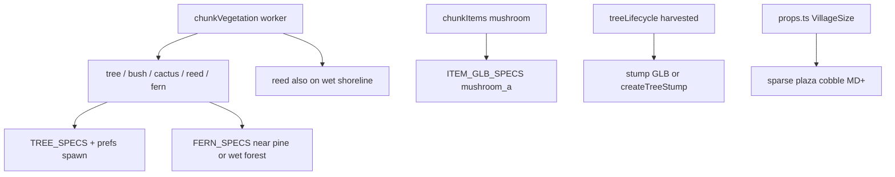

# Plan: Krajobraz — sosna, poszycie, trzcina, pień, bruk

**Created:** 2026-08-17  
**Status:** `verification needed` 🔍  
**Priority:** medium · **Effort:** L  
**Depends on:** ~~024~~ ~~073~~ ~~065~~ ~~082~~ ~~101~~

Zaimplementowane w `4d2a9b5865c9ef5e385ed5e5b4c8f21473a268ff` (2026-08-18). Wierzba świadomie `needed` ([MODELS.md](../assets/MODELS.md) M43). Browser: do potwierdzenia.

## Cel

Wypełnić krajobraz gatunkami, których brakuje przy chodzeniu po świecie: iglaki na stokach, paprocie i grzyby w wilgotnym lesie, trzcina przy wodzie, pień po wycince, oszczędny bruk w większych wsiach. Bez nowego menedżera — rozszerzyć `TREE_SPECS` / `chunkVegetation` / `chunkItems` / `props.ts`.

### Efekt gameplay

- wyższe / chłodniejsze stoki czytają się jako las iglasty (kilka wariantów sosny),
- paprocie przy lesie, iglakach i terenie wilgotnym — nie na pustyni,
- zbieralny grzyb ma GLB i te same biomes,
- trzcina także przy mokrym brzegu jeziora, nie tylko w swamie,
- po ostatnim etapie siekiery widać pień GLB (albo dotychczasowy proceduralny fallback),
- MD+ wsie mają kilka płyt bruku przy placu; SM/OUTPOST bez bruku.

## Decyzje (2026-08-17)

- Sosna: TAK, kilka wariantów, **tylko textured** (nie Ultimate Nature Pack jako las).
- Paproć / grzyb: las, okolice iglaków, teren wilgotny.
- Wierzba: TAK, ten sam constraint stylu; brak textured pliku nie blokuje reszty.
- Góry w tle (`mountain_a/b/c`): NIE.
- Pień po harvestcie: TAK.
- Rośliny wodne: trzcina (nie lilie).
- Bruk: TAK, zależnie od `VillageSize`, mało.
- `grass_clump` / `rock_b`: nie w tym planie.

## Źródła assetów

**Ultimate Stylized Nature — komplet na dysku:** [`_temp/Models/Ultimate Stylized Nature/`](../../_temp/Models/Ultimate%20Stylized%20Nature/) (`FBX/` + `glTF/` + `Textures/`).

- glTF: maple / birch / dead / krzewy / kwiaty / trawa — **bez** `PineTree_*.gltf` (tak opublikowane).
- FBX: m.in. `PineTree_1.fbx`…`PineTree_5.fbx`, `PalmTree_*`, `NormalTree_*`, `Rock_1`…`5`. Brak willow, stump, fern, mushroom.
- Textures: `PineTree_Bark` / `PineTree_Leaves` (ten sam atlas co maple/brzoza).

**Sosna:** `PineTree_1`, `PineTree_3`, `PineTree_5` → FBX→GLB + te tekstury (512 WebP, `gltfpack -cc`) → `public/models/nature/pine_1.glb` itd.

Parked [`pine_trees.glb`](../../public/models/nature/pine_trees.glb): Asset Browser. Jedno drzewo → opcjonalny 4. wariant. Kępa → parked.

**Paproć / grzyb / bruk / trzcina:** już w `public/models/nature/` (`fern_a`, `mushroom_a`, `rock_path_round_wide`, `reed_a`).

**Wierzba:** tego packa nie ma. Vertex-color Nature Pack odrzucony. 1–2 textured z Nature MegaKit / Poly Pizza; **brak pliku nie blokuje reszty** — wtedy nowy wiersz w [MODELS.md](../assets/MODELS.md) zostaje `needed`.

**Pień:** brak textured stump w Stylized Nature. Nature Pack `TreeStump` (vertex-color) wyłącznie jako remnant harvestu (mały, brązowy, nie korona lasu), z proceduralnym [`createTreeStump`](../../src/settlement/props.ts) jako fallback. Jeśli w przeglądarce gryzie się z textured pniem — wrócić do proceduralnego.

**Poza tym planem z tego FBX:** palmy, `NormalTree_*`, `Rock_1`…`5`.

## Architektura (bez nowego menedżera)

Istniejące sprzężenia: [`TREE_SPECS`](../../src/settlement/propSpecs.ts), [`TREE_SPECIES_PREFS`](../../src/world/treeLifecycle.ts) (dziś tylko **wzrost**, nie spawn — [`clusteredTreeSpecies`](../../src/terrain/chunkVegetation.ts) losuje z 3 band), [`VegetationKind`](../../src/terrain/chunkHeightmap.ts), instancing w [`chunkManager.ts`](../../src/terrain/chunkManager.ts), clutter w [`props.ts`](../../src/settlement/props.ts).

## Etapy

### 1. Konwersja sosen (+ opcjonalnie wierzba, pień)

- `PineTree_1/3/5.fbx` z [`_temp/Models/Ultimate Stylized Nature/FBX/`](../../_temp/Models/Ultimate%20Stylized%20Nature/FBX/) + tekstury `PineTree_*` → `public/models/nature/pine_1.glb` itd.
- Werdykt parked `pine_trees.glb` w Asset Browserze.
- Wierzba jeśli plik textured jest; pień `TreeStump` → `nature/tree_stump.glb`.
- Wiersze w [CREDITS.md](../assets/CREDITS.md) + [MODELS.md](../assets/MODELS.md).

### 2. Gatunki drzew i spawn

Dopisać sosny (i wierzba gdy jest) do `TREE_SPECS`. Zsynchronizować `TREE_TEMPLATE_HEIGHT_M` (musi mieć tę samą długość).

Rozszerzyć `TREE_SPECIES_PREFS`:

- sosna: niski swamp, wysoki `mountain`, średni forest
- wierzba: wysoki swamp, niski mountain/desert
- istniejące liściaste bez dużej zmiany

W [`chunkVegetation.ts`](../../src/terrain/chunkVegetation.ts) zastąpić `clusteredTreeSpecies` **ważonym losowaniem z prefs** (biome + altitude/ridge), z zachowaniem `clumpNoise` żeby stanowisko powtarzało ten sam gatunek. Prefs zostają w `treeLifecycle.ts` (worker nie importuje THREE — przekazać wagi analogicznie do `vegetationSpeciesCount`, albo zduplikować czystą tablicę w module worker-safe). Nie importować `props.ts` do workera.

Stała `PINE_SPECIES_INDICES` do paproci/grzybów.

### 3. Paproć — nowy `VegetationKind: 'fern'`

Nie wrzucać paproci do ogólnego `BUSH_SPECS` (kwiaty tam już wpadają też na pustynię jako losowy krzew).

- `FERN_SPECS` w `propSpecs.ts`, fallback `createFern` (spłaszczony krzew).
- `VegetationKind` += `'fern'`; `vegetationSpeciesCount.fern`; kubełek w pętli instancingu `bush/cactus/reed`.
- Druga passa po drzewach w `computeChunkVegetation` (wzorzec `flowerMeadowPatches`):
  - odrzut: pustynia, droga, treeline, stromy stok
  - akceptacja gdy `forestDensity` wysoki **lub** `biome.swamp` **lub** w tym chunku jest sosna w promieniu ~8 m
  - niska liczba kandydatów (poszycie, nie dywan)

Testy w istniejącym stylu `chunkHeightmap.test.ts` / nowy `chunkVegetation.test.ts`: paproć nie spawni się na pustyni; spawni się przy pine/wet forest.

### 4. Grzyb — pickup GLB + te same biomes

Nie drugi system dekoracji (uniknąć podwójnych grzybów obok zbieralnych).

- [`ITEM_GLB_SPECS`](../../src/items/itemModels.ts): `mushroom` → `mushroom_a.glb`, `preparePropFitMax` mały (~0.25–0.4 m), fallback proceduralny zostaje.
- [`chunkItems.ts`](../../src/terrain/chunkItems.ts): wzmocnić `mushroomWeight` przy `treeClose`, swamp/forest; dodać bonus gdy w vegetation chunka jest sosna (ten sam `vegetation[]` już przekazywany).

### 5. Trzcina przy wodzie

Zostaje `reed_a` (jeden model). Dziś reed prawie tylko przy `biome.swamp > 0.5`.

Rozszerzyć: jeśli wysokość blisko `waterLevel` i **nie** pustynia, duża szansa `kind = 'reed'` (jezioro + mokry brzeg). Nie kłaść cattaili na suchym piasku plaży (niski moisture + coast). Gęstość umiarkowana — nie ściana trzcin.

### 6. Pień harvestu

[`createTreeStageMesh`](../../src/terrain/chunkManager.ts) / `createTreeStump`: `loadPropOrFallback` na `tree_stump.glb` gdy plik jest. Stadia `limbed`/`felled` bez zmian. Fallback proceduralny obowiązkowy.

### 7. Bruk w osadzie

[`rock_path_round_wide.glb`](../../public/models/nature/rock_path_round_wide.glb) jako clutter, **nie** jako mesh dróg świata (G9 zostaje tint).

W [`props.ts`](../../src/settlement/props.ts), po placu/studni, instancing jak siano/beczki:

- `OUTPOST` / `SM`: 0
- `MD`: 2–4 płyty przy studni / wewnętrzny pierścień placu
- `LG`: 4–6
- `XL`: 6–8

Odrzut: korytarze `pathCorridors`, woda, nachodzenie na studnię/ognisko. Żadnego tapetowania `VillagePathPlan`. Skala `preparePropFitMax` ostrożna (płyta ~1.2–1.8 m), yaw losowy.

### 8. Docs i weryfikacja

- [MODELS.md](../assets/MODELS.md): M12/M26/M27/M28; M06 kwiaty oznaczyć `wired` (już w `BUSH_SPECS`); M05 góry zostają parked.
- [CREDITS.md](../assets/CREDITS.md), [parked/README.md](../../public/models/parked/README.md), krótki akapit w [STATE.md](../STATE.md) (wegetacja).
- Testy: prefs length vs `TREE_SPECS`; fern gates; cobble count po `VillageSize` (jeśli da się wyciągnąć czystą funkcję `cobbleCountForSize`).
- Tech: `npx tsc --noEmit`, `npm run lint`, `npm run build`, `npm run test`.
- Browser (user): las iglasty na stokach; paprocie w wilgotnym lesie nie na pustyni; grzyb GLB; trzcina przy jeziorze; pień po `[E]` siekierą; MD+ kilka płyt przy studni, SM/OUTPOST bez bruku.

## Poza zakresem

- Góry w tle, `grass_clump`, `rock_b`, lilie, sezonowe meshe śnieg/jesień, Nature Pack jako las, bruk na drogach świata, nowy `VegetationKind` dla grzyba, palmy / `NormalTree_*` / `Rock_1`…`5` z FBX Stylized Nature.

## Kryteria ukończenia

- [x] 3 warianty sosny (`pine_1/3/5`) w `TREE_SPECS` i CREDITS; spawn bias na highland/ridge.
- [x] Paproć jako `VegetationKind: 'fern'` w lesie / przy iglakach / wilgoci, nie na pustyni.
- [x] Pickup `mushroom` używa `mushroom_a.glb` (proceduralny fallback).
- [x] Trzcina na mokrym brzegu poza samym swamp gate.
- [x] Harvest `harvested` → pień GLB lub dotychczasowy proceduralny fallback.
- [x] Bruk: 0 na SM/OUTPOST; 2–8 płyt na MD–XL przy placu, nie na drogach świata.
- [x] Wierzba wired **albo** jawny `needed` w MODELS.md.
- [x] `tsc` / lint / build / test zielone.
- [ ] Browser: do potwierdzenia (osobno od technicznej weryfikacji).
