# Plan Recommendations

## Top 5

### Overall

1. `settlements-npcs-018` — **Physical Goods Transport Foundation**  
   🔴 `M` · ✅ ready · unlocks 3/3
2. `settlements-npcs-019` — **Persistent & Off-screen Transport**  
   🔴 `M` · 🔒 blocked · unlocks 2/2
3. `settlements-npcs-015` — **Economic Production and Input Integration**  
   🔴 `M` · ✅ ready · unlocks 1/2
4. `settlements-npcs-016` — **First Processing Chain and Blacksmith Production**  
   🔴 `M` · 🔒 blocked · unlocks 1/1
5. `settlements-npcs-017` — **Production Demand and Economic Pressures**  
   🔴 `M` · 🔒 blocked · unlocks 0/0

---

### Roadmap Focus

1. `settlements-npcs-018` — **Physical Goods Transport Foundation**  
   🔴 `M` · ✅ ready · unlocks 3/3 · roadmap: `physical-goods-transport`
2. `settlements-npcs-019` — **Persistent & Off-screen Transport**  
   🔴 `M` · 🔒 blocked · unlocks 2/2 · roadmap: `physical-goods-transport`
3. `settlements-npcs-015` — **Economic Production and Input Integration**  
   🔴 `M` · ✅ ready · unlocks 1/2 · roadmap: `economy-production`
4. `settlements-npcs-016` — **First Processing Chain and Blacksmith Production**  
   🔴 `M` · 🔒 blocked · unlocks 1/1 · roadmap: `economy-production`
5. `settlements-npcs-017` — **Production Demand and Economic Pressures**  
   🔴 `M` · 🔒 blocked · unlocks 0/0 · roadmap: `economy-production`

---

### Bug Fixes

_No qualifying plans._

---

### Polish

1. `npc-004` — **Drzewo genealogiczne NPC**  
   ⚪ `S` · ✅ ready · unlocks 0/0

---

### Ready Now

1. `settlements-npcs-018` — **Physical Goods Transport Foundation**  
   🔴 `M` · ✅ ready · unlocks 3/3
2. `settlements-npcs-015` — **Economic Production and Input Integration**  
   🔴 `M` · ✅ ready · unlocks 1/2
3. `settlements-npcs-022` — **Household help and age-based work participation**  
   🔴 `M` · ✅ ready · unlocks 0/0
4. `fauna-004` — **Sheep wool cycle and shepherd**  
   🟡 `L` · ✅ ready · unlocks 1/2
5. `npc-010` — **NPC Death & Corpse Lifecycle**  
   🟡 `L` · ✅ ready · unlocks 1/1

---

## How to read this

The Top 5 sections above are independent perspectives on the same plan set — each answers "what is worth looking at now" from a different angle. They are not alternative execution orders and may overlap or disagree with each other.

The Recommended Execution Order below is the single dependency-aware schedule: it is the order in which `planned` plans can actually be implemented, respecting prerequisites. Use the Top 5 to decide what to prioritize; use the execution order to see what is unblocked next.

---

## Recommended Execution Order

Only planned plans are ranked.  
done / verification needed satisfy dependencies.  
Score = priority + direct unlocks + transitive unlocks + depth - effort.

1. `settlements-npcs-018` — **Physical Goods Transport Foundation**  
  🔴 `M` · **Score:**  95  
   → **unlocks:** 3/3

2. `settlements-npcs-019` — **Persistent & Off-screen Transport**  
  🔴 `M` · **Score:**  83  
   → **unlocks:** 2/2

3. `settlements-npcs-015` — **Economic Production and Input Integration**  
  🔴 `M` · **Score:**  77  
   → **unlocks:** 1/2

4. `settlements-npcs-016` — **First Processing Chain and Blacksmith Production**  
  🔴 `M` · **Score:**  69  
   → **unlocks:** 1/1

5. `settlements-npcs-017` — **Production Demand and Economic Pressures**  
  🔴 `M` · **Score:**  57  
   → **unlocks:** 0/0

6. `settlements-npcs-022` — **Household help and age-based work participation**  
  🔴 `M` · **Score:**  43  
   → **unlocks:** 0/0

7. `fauna-004` — **Sheep wool cycle and shepherd**  
  🟡 `L` · **Score:**  38  
   → **unlocks:** 1/2

8. `npc-010` — **NPC Death & Corpse Lifecycle**  
  🟡 `L` · **Score:**  36  
   → **unlocks:** 1/1

9. `fauna-014` — **Animal traps — bait attraction and species coverage**  
  🟡 `M` · **Score:**  33  
   → **unlocks:** 1/1

10. `settlements-npcs-006` — **Wool to material**  
  🟡 `M` · **Score:**  33  
   → **unlocks:** 1/1

11. `items-player-002` — **Food provenance, freshness and storage**  
  🟡 `M` · **Score:**  29  
   → **unlocks:** 0/0

12. `items-player-014` — **Rope-pullable resource transport**  
  🟡 `M` · **Score:**  27  
   → **unlocks:** 0/0

13. `settlements-npcs-023` — **Profession staffing and settlement composition**  
  🔴 `M` · **Score:**  27  
   → **unlocks:** 0/0

14. `tools-005` — **Seedvale Character Preparation Panel**  
  🔴 `M` · **Score:**  27  
   → **unlocks:** 0/0

15. `npc-002` — **NPC Healing**  
  🟡 `M` · **Score:**  25  
   → **unlocks:** 0/0

16. `npc-011` — **NPC Burial & Graves**  
  🟡 `L` · **Score:**  24  
   → **unlocks:** 0/0

17. `tools-007` — **MPFB2 NPC / Hero Character Pipeline**  
  🔴 `L` · **Score:**  24  
   → **unlocks:** 0/0

18. `fauna-012` — **Animal threat perception and vocalization responses**  
  🟡 `M` · **Score:**  21  
   → **unlocks:** 0/0

19. `fauna-013` — **Animal hand-feeding and human affinity**  
  🟡 `M` · **Score:**  21  
   → **unlocks:** 0/0

20. `npc-016` — **Work Contracts — Payment & Employer Interaction**  
  🟡 `M` · **Score:**  21  
   → **unlocks:** 0/0

21. `npc-017` — **Work Contracts — Food & Drink for Hired NPCs**  
  🟡 `M` · **Score:**  21  
   → **unlocks:** 0/0

22. `settlements-npcs-007` — **Bandages and herbal medicine**  
  🟡 `M` · **Score:**  21  
   → **unlocks:** 0/0

23. `fauna-007` — **Animal leading and cart harness**  
  🟡 `L` · **Score:**  18  
   → **unlocks:** 0/0

24. `tools-000` — **Weapon Browser — Observatory/Admin**  
  🟡 `M` · **Score:**  17  
   → **unlocks:** 0/0

25. `world-terrain-008` — **Underground Caves V2**  
  🟡 `XL` · **Score:**  10  
   → **unlocks:** 0/0

26. `npc-004` — **Drzewo genealogiczne NPC**  
  ⚪ `S` · **Score:**   9  
   → **unlocks:** 0/0

27. `tools-006` — **tools-006--world-observatory.md**  
  ⚪ `XL` · **Score:**   0  
   → **unlocks:** 0/0

---

## Initially Blocked

- [`fauna-007-animal-leading-and-cart-harness.md`](fauna-007-animal-leading-and-cart-harness.md)  
  is blocked by:
  - [`fauna-014-animal-traps-bait-attraction-and-species-coverage.md`](fauna-014-animal-traps-bait-attraction-and-species-coverage.md)
- [`npc-011-npc-burial-and-graves.md`](npc-011-npc-burial-and-graves.md)  
  is blocked by:
  - [`npc-010-death-and-corpse-lifecycle.md`](npc-010-death-and-corpse-lifecycle.md)
- [`settlements-npcs-006-wool-to-material.md`](settlements-npcs-006-wool-to-material.md)  
  is blocked by:
  - [`fauna-004-sheep-wool-and-shepherd.md`](fauna-004-sheep-wool-and-shepherd.md)
- [`settlements-npcs-007-bandages-and-herbal-medicine.md`](settlements-npcs-007-bandages-and-herbal-medicine.md)  
  is blocked by:
  - [`settlements-npcs-006-wool-to-material.md`](settlements-npcs-006-wool-to-material.md)
- [`settlements-npcs-016-first-processing-chain-and-blacksmith-production.md`](settlements-npcs-016-first-processing-chain-and-blacksmith-production.md)  
  is blocked by:
  - [`settlements-npcs-015-economic-production-and-input-integration.md`](settlements-npcs-015-economic-production-and-input-integration.md)
- [`settlements-npcs-017-production-demand-and-economic-pressures.md`](settlements-npcs-017-production-demand-and-economic-pressures.md)  
  is blocked by:
  - [`settlements-npcs-016-first-processing-chain-and-blacksmith-production.md`](settlements-npcs-016-first-processing-chain-and-blacksmith-production.md)
- [`settlements-npcs-019-persistent-and-off-screen-transport.md`](settlements-npcs-019-persistent-and-off-screen-transport.md)  
  is blocked by:
  - [`settlements-npcs-018-physical-goods-transport-foundation.md`](settlements-npcs-018-physical-goods-transport-foundation.md)

---

## Dependency Graph

Planned plans and their dependencies.

```mermaid
graph TD
  008["008 — Trawa (instanced ground cover)"]
  040["040 — Pory roku i pogoda"]
  069["069 — 2026-08-11--069--npc-household-resources.md"]
  097["097 — Fizyka — opadanie przedmiotów, kolizje, skok"]
  106["106 — 2026-08-14--106--player-needs-food-and-cooking.md"]
  111["111 — 2026-08-14--111--house-construction.md"]
  122["122 — Natural Resource Gathering & Water Distribution"]
  125["125 — Fauna — limity populacji i wyczerpywanie spawn pointów"]
  126["126 — Seed Planting — Trees & Crops"]
  127["127 — Player-Built Well"]
  133["133 — Weather Surface Effects — Wet Ground, Puddles & Snow Cover"]
  151["151 — Social Places and Social Behaviour"]
  155["155 — Inventory item instances i lifecycle pułapek"]
  156["156 — NPC Household and Settlement Storage Logistics"]
  159["159 — Natural Food, Fishing, Preservation and Bait"]
  164["164 — Player Storage & Container System"]
  174["174 — Player Garden and NPC Need Sources"]
  176["176 — Garden and Field Maintenance"]
  177["177 — NPC Combat"]
  178["178 — Hunter Profession and Household"]
  179["179 — Animal Attack & NPC Defense"]
  184["184 — Item Capability Abstraction"]
  187["187 — Building Resources"]
  188["188 — Fauna and Dead Animal Lifecycle"]
  191["191 — Mountain Peaks & Mountain Massifs"]
  192["192 — Time & Simulation Consistency"]
  ai_001["ai-001 — NPC Pressure Layer"]
  ai_002["ai-002 — NPC Personality-aware Decisions"]
  ai_003["ai-003 — NPC Candidate Strategies"]
  ai_004["ai-004 — NPC Goals & Persistent Plans"]
  fauna_001["fauna-001 — Rabies and Animal Infection"]
  fauna_002["fauna-002 — Livestock Food Production"]
  fauna_003["fauna-003 — Jazda konna"]
  fauna_004["fauna-004 — Sheep wool cycle and shepherd"]
  fauna_005["fauna-005 — Animal Corpse and Bone Feeding"]
  fauna_006["fauna-006 — Wolf Settlement Entry"]
  fauna_007["fauna-007 — Animal leading and cart harness"]
  fauna_008["fauna-008 — Riding Skill Effects"]
  fauna_009["fauna-009 — Wolf Howling and Rooster Vocalization"]
  fauna_010["fauna-010 — Species metabolism, herbivore diet and renewable forage"]
  fauna_011["fauna-011 — Domestic dogs and household guarding"]
  fauna_012["fauna-012 — Animal threat perception and vocalization responses"]
  fauna_013["fauna-013 — Animal hand-feeding and human affinity"]
  fauna_014["fauna-014 — Animal traps — bait attraction and species coverage"]
  items_player_001["items-player-001 — Containers, Waterskins & Copper Items"]
  items_player_002["items-player-002 — Food provenance, freshness and storage"]
  items_player_003["items-player-003 — Player Physical Effort — Stamina & Vigor"]
  items_player_009["items-player-009 — Player-Built Torch and Ignition"]
  items_player_010["items-player-010 — Player-Built Palisade and Building Removal"]
  items_player_011["items-player-011 — Melee attack direction consistency"]
  items_player_012["items-player-012 — Player Gathering and Fire Cooking Polish"]
  items_player_013["items-player-013 — Player-Built Sleeping Utilities"]
  items_player_014["items-player-014 — Rope-pullable resource transport"]
  items_player_015["items-player-015 — Firewood, Wood Piles and Scalable Fire"]
  items_player_016["items-player-016 — Books and Skill Learning"]
  npc_001["npc-001 — NPC Physical Stats — Sex & Age"]
  npc_002["npc-002 — NPC Healing"]
  npc_004["npc-004 — Drzewo genealogiczne NPC"]
  npc_005["npc-005 — NPC & Animal Target Commitment"]
  npc_006["npc-006 — Shared NPC and Animal Pathfinding"]
  npc_007["npc-007 — NPC Navigation — Interaction Destination Approach"]
  npc_008["npc-008 — Agent Decision Architecture Refactor"]
  npc_009["npc-009 — NPC Combat Feedback"]
  npc_010["npc-010 — NPC Death & Corpse Lifecycle"]
  npc_011["npc-011 — NPC Burial & Graves"]
  npc_012["npc-012 — NPC weather reaction & shelter"]
  npc_013["npc-013 — NPC night campfire gathering"]
  npc_014["npc-014 — Work Contracts — Foundation & Physical Posting"]
  npc_015["npc-015 — Work Contracts — NPC Work & Construction"]
  npc_016["npc-016 — Work Contracts — Payment & Employer Interaction"]
  npc_017["npc-017 — Work Contracts — Food & Drink for Hired NPCs"]
  persistence_001["persistence-001 — Full Simulation Persistence"]
  persistence_002["persistence-002 — save integrity guard"]
  persistence_003["persistence-003 — save schema versioning and future migrations"]
  persistence_004["persistence-004 — Save Integrity and World Lifecycle"]
  settlements_001["settlements-001 — House Collision Geometry"]
  settlements_002["settlements-002 — House Browser"]
  settlements_npcs_001["settlements-npcs-001 — Cultivation Hydration & Watering"]
  settlements_npcs_002["settlements-npcs-002 — NPC professions — complete profession work integration"]
  settlements_npcs_003["settlements-npcs-003 — Hunter Arrow Production"]
  settlements_npcs_004["settlements-npcs-004 — Animal and NPC Social Audio"]
  settlements_npcs_005["settlements-npcs-005 — Local Resource Exchange"]
  settlements_npcs_006["settlements-npcs-006 — Wool to material"]
  settlements_npcs_007["settlements-npcs-007 — Bandages and herbal medicine"]
  settlements_npcs_008["settlements-npcs-008 — Household & Settlement Food Storage Model"]
  settlements_npcs_009["settlements-npcs-009 — Physical Storage Destinations & Resource Delivery"]
  settlements_npcs_010["settlements-npcs-010 — Physical Storage Visualization"]
  settlements_npcs_011["settlements-npcs-011 — Household Yards & Settlement Space"]
  settlements_npcs_012["settlements-npcs-012 — Physical Storage Inspection"]
  settlements_npcs_013["settlements-npcs-013 — Hierarchical Domain History"]
  settlements_npcs_014["settlements-npcs-014 — Local Goods Circulation"]
  settlements_npcs_015["settlements-npcs-015 — Economic Production and Input Integration"]
  settlements_npcs_016["settlements-npcs-016 — First Processing Chain and Blacksmith Production"]
  settlements_npcs_017["settlements-npcs-017 — Production Demand and Economic Pressures"]
  settlements_npcs_018["settlements-npcs-018 — Physical Goods Transport Foundation"]
  settlements_npcs_019["settlements-npcs-019 — Persistent & Off-screen Transport"]
  settlements_npcs_020["settlements-npcs-020 — Economy-driven Transport Demand Integration"]
  settlements_npcs_021["settlements-npcs-021 — Remote Production Site Logistics"]
  settlements_npcs_022["settlements-npcs-022 — Household help and age-based work participation"]
  settlements_npcs_023["settlements-npcs-023 — Profession staffing and settlement composition"]
  tools_000["tools-000 — Weapon Browser — Observatory/Admin"]
  tools_001["tools-001 — Performance Benchmark Determinism & Reliability"]
  tools_002["tools-002 — Trace Analyzer — Real Application CPU Attribution"]
  tools_003["tools-003 — House Browser and Tools Menu"]
  tools_004["tools-004 — Claude Preflight Completion"]
  tools_005["tools-005 — Seedvale Character Preparation Panel"]
  tools_006["tools-006 — tools-006--world-observatory.md"]
  tools_007["tools-007 — MPFB2 NPC / Hero Character Pipeline"]
  tools_009["tools-009 — plan metadata contract, migration and documentation generation"]
  tools_010["tools-010 — Recommended Order Rankings and Actionable Plan Dashboard"]
  tools_011["tools-011 — Plan metadata graceful repair and self-healing synchronization"]
  tools_012["tools-012 — Draft plans README automatic sync"]
  ui_input_001["ui-input-001 — Developer Debug API"]
  ui_input_002["ui-input-002 — UI/UX Interaction and Action System Polish"]
  ui_input_003["ui-input-003 — Merchant Trade UI/UX Redesign"]
  ui_input_004["ui-input-004 — Construction Placement & Terrain Preparation UX"]
  ui_input_005["ui-input-005 — Lodging Navigation Recovery and Cancellation"]
  ui_input_006["ui-input-006 — Fishing UX and Water Support"]
  ui_input_007["ui-input-007 — Player Action Contracts & Quick Actions Availability"]
  ui_input_008["ui-input-008 — River debug location quality"]
  world_001["world-001 — Playtest Gameplay Fixes — Stamina, Fire Time-Skip and Bear Behaviour"]
  world_003["world-003 — Faster Application Startup"]
  world_004["world-004 — Well Depth, Groundwater & Well Protection"]
  world_005["world-005 — New Game — reset czasu świata"]
  world_006["world-006 — Time, Weather and Biome Ambient Soundscape"]
  world_007["world-007 — Hidden Finds & Reputation Badges"]
  world_008["world-008 — Player World Placement Foundation"]
  world_009["world-009 — Blood Traces"]
  world_010["world-010 — Environmental Placement Consequences"]
  world_011["world-011 — Water Types and Drinking"]
  world_012["world-012 — World Locations, Discovery and Map Navigation"]
  world_013["world-013 — World Location Catalog performance optimization"]
  world_terrain_001["world-terrain-001 — Cloud System"]
  world_terrain_002["world-terrain-002 — Terrain Modification & Land Preparation"]
  world_terrain_003["world-terrain-003 — Weather puddles V2 — stronger shader surface effect"]
  world_terrain_004["world-terrain-004 — Chunk mesh streaming geometry optimization"]
  world_terrain_005["world-terrain-005 — Distance-Based Terrain Detail LOD"]
  world_terrain_006["world-terrain-006 — World Generation & Placement Correctness"]
  world_terrain_007["world-terrain-007 — Underground Caves"]
  world_terrain_008["world-terrain-008 — Underground Caves V2"]
  world_terrain_009["world-terrain-009 — Seasonal ground and grass appearance"]
  world_terrain_010["world-terrain-010 — Waterways and Vegetation"]
  008 --> items_player_010
  040 --> npc_012
  069 --> settlements_npcs_008
  097 --> world_terrain_007
  106 --> items_player_012
  106 --> settlements_npcs_008
  111 --> settlements_001
  111 --> settlements_002
  111 --> tools_003
  122 --> items_player_012
  122 --> items_player_014
  122 --> items_player_015
  122 --> settlements_npcs_008
  122 --> world_011
  125 --> world_terrain_007
  126 --> settlements_npcs_001
  127 --> world_004
  133 --> world_terrain_003
  151 --> npc_013
  151 --> settlements_npcs_004
  155 --> items_player_002
  155 --> items_player_014
  156 --> settlements_npcs_005
  159 --> items_player_002
  159 --> items_player_012
  159 --> ui_input_006
  164 --> items_player_002
  174 --> settlements_npcs_001
  176 --> settlements_npcs_001
  177 --> items_player_011
  177 --> npc_002
  177 --> npc_005
  177 --> npc_009
  177 --> npc_010
  178 --> settlements_npcs_002
  178 --> settlements_npcs_003
  179 --> npc_005
  179 --> npc_009
  184 --> items_player_002
  184 --> settlements_npcs_002
  184 --> settlements_npcs_003
  184 --> ui_input_006
  187 --> settlements_npcs_003
  188 --> fauna_001
  191 --> world_terrain_006
  192 --> world_001
  ai_001 --> ai_002
  ai_001 --> ai_003
  ai_001 --> ai_004
  ai_002 --> ai_003
  ai_002 --> ai_004
  ai_003 --> ai_004
  fauna_003 --> fauna_008
  fauna_004 --> settlements_npcs_006
  fauna_006 --> fauna_007
  fauna_010 --> fauna_011
  fauna_010 --> fauna_012
  fauna_010 --> fauna_013
  fauna_010 --> fauna_014
  fauna_011 --> fauna_012
  fauna_011 --> fauna_013
  fauna_014 --> fauna_007
  items_player_001 --> fauna_002
  items_player_009 --> items_player_013
  items_player_009 --> items_player_015
  items_player_010 --> items_player_013
  npc_006 --> npc_007
  npc_007 --> npc_009
  npc_010 --> npc_011
  npc_014 --> npc_015
  npc_015 --> npc_016
  npc_015 --> npc_017
  persistence_002 --> persistence_003
  persistence_002 --> persistence_004
  persistence_003 --> persistence_004
  settlements_npcs_002 --> settlements_npcs_005
  settlements_npcs_002 --> settlements_npcs_022
  settlements_npcs_005 --> settlements_npcs_008
  settlements_npcs_005 --> settlements_npcs_009
  settlements_npcs_006 --> settlements_npcs_007
  settlements_npcs_008 --> settlements_npcs_009
  settlements_npcs_008 --> settlements_npcs_014
  settlements_npcs_009 --> settlements_npcs_010
  settlements_npcs_009 --> settlements_npcs_012
  settlements_npcs_009 --> settlements_npcs_014
  settlements_npcs_010 --> settlements_npcs_012
  settlements_npcs_010 --> settlements_npcs_014
  settlements_npcs_014 --> settlements_npcs_015
  settlements_npcs_014 --> settlements_npcs_018
  settlements_npcs_015 --> settlements_npcs_016
  settlements_npcs_016 --> settlements_npcs_017
  settlements_npcs_018 --> settlements_npcs_019
  settlements_npcs_018 --> settlements_npcs_020
  settlements_npcs_018 --> settlements_npcs_021
  settlements_npcs_019 --> settlements_npcs_020
  settlements_npcs_019 --> settlements_npcs_021
  settlements_npcs_020 --> settlements_npcs_021
  tools_010 --> tools_011
  tools_011 --> tools_012
  ui_input_001 --> ui_input_008
  world_008 --> items_player_009
  world_012 --> items_player_016
  world_012 --> world_013
  world_terrain_004 --> world_terrain_005
```

