Recommended plan execution order
================================

Only planned plans are ranked.
done / verification needed satisfy dependencies.
Score = priority + direct unlocks + transitive unlocks + depth - effort.

1. `settlements-npcs-014` - **Local Goods Circulation**  
  🔴 M · **Score:**  63  
   → **unlocks:** 1/3

2. `settlements-npcs-015` - **Economic Production and Input Integration**  
  🔴 M · **Score:**  55  
   → **unlocks:** 1/2

3. `settlements-npcs-016` - **First Processing Chain and Blacksmith Production**  
  🔴 M · **Score:**  47  
   → **unlocks:** 1/1

4. `npc-015` - **Work Contracts — NPC Work & Construction**  
  🟡 L · **Score:**  44  
   → **unlocks:** 2/2

5. `fauna-004` - **Sheep wool cycle and shepherd**  
  🟡 L · **Score:**  38  
   → **unlocks:** 1/2

6. `settlements-npcs-017` - **Production Demand and Economic Pressures**  
  🔴 M · **Score:**  35  
   → **unlocks:** 0/0

7. `settlements-npcs-006` - **Wool to material**  
  🟡 M · **Score:**  33  
   → **unlocks:** 1/1

8. `items-player-002` - **Food provenance, freshness and storage**  
  🟡 M · **Score:**  29  
   → **unlocks:** 0/0

9. `items-player-014` - **Rope-pullable resource transport**  
  🟡 M · **Score:**  27  
   → **unlocks:** 0/0

10. `tools-005` - **Seedvale Character Preparation Panel**  
  🔴 M · **Score:**  27  
   → **unlocks:** 0/0

11. `npc-002` - **NPC Healing**  
  🟡 M · **Score:**  25  
   → **unlocks:** 0/0

12. `tools-007` - **MPFB2 NPC / Hero Character Pipeline**  
  🔴 L · **Score:**  24  
   → **unlocks:** 0/0

13. `tools-009` - **plan metadata contract, migration and documentation generation**  
  🔴 L · **Score:**  24  
   → **unlocks:** 0/0

14. `world-004` - **Well Depth, Groundwater & Well Protection**  
  🟡 M · **Score:**  23  
   → **unlocks:** 0/0

15. `npc-010` - **NPC Death & Corpse Lifecycle**  
  🟡 L · **Score:**  22  
   → **unlocks:** 0/0

16. `fauna-008` - **Riding Skill Effects**  
  🟡 S · **Score:**  21  
   → **unlocks:** 0/0

17. `npc-016` - **Work Contracts — Payment & Employer Interaction**  
  🟡 M · **Score:**  21  
   → **unlocks:** 0/0

18. `npc-017` - **Work Contracts — Food & Drink for Hired NPCs**  
  🟡 M · **Score:**  21  
   → **unlocks:** 0/0

19. `settlements-npcs-007` - **Bandages and herbal medicine**  
  🟡 M · **Score:**  21  
   → **unlocks:** 0/0

20. `tools-000` - **Weapon Browser — Observatory/Admin**  
  🟡 M · **Score:**  17  
   → **unlocks:** 0/0

21. `fauna-007` - **Animal leading and cart harness**  
  🟡 L · **Score:**  16  
   → **unlocks:** 0/0

22. `npc-011` - **NPC Burial & Graves**  
  🟡 L · **Score:**  16  
   → **unlocks:** 0/0

23. `npc-004` - **Drzewo genealogiczne NPC (rody Sema/Chama/Jafeta) + kompas „N" na minimapie**  
  ⚪ S · **Score:**   9  
   → **unlocks:** 0/0

24. `tools-006` - **tools-006--world-observatory.md**  
  ⚪ XL · **Score:**   0  
   → **unlocks:** 0/0

Initially blocked
=================
- npc-016: npc-015
- npc-017: npc-015
- settlements-npcs-006: fauna-004
- settlements-npcs-007: settlements-npcs-006
- settlements-npcs-015: settlements-npcs-014
- settlements-npcs-016: settlements-npcs-015
- settlements-npcs-017: settlements-npcs-016

Dependency graph (planned + their dependencies)
================================================

```mermaid
graph TD
  ai_001["ai-001"]
  ai_002["ai-002"]
  ai_001 --> ai_002
  ai_003["ai-003"]
  ai_001 --> ai_003
  ai_002 --> ai_003
  ai_004["ai-004"]
  001 --> ai_004
  002 --> ai_004
  003 --> ai_004
  fauna_001["fauna-001"]
  188 --> fauna_001
  fauna_002["fauna-002"]
  items_player_001 --> fauna_002
  fauna_003["fauna-003"]
  fauna_004["fauna-004"]
  fauna_005["fauna-005"]
  fauna_006["fauna-006"]
  fauna_007["fauna-007"]
  014 --> fauna_007
  006 --> fauna_007
  fauna_008["fauna-008"]
  003 --> fauna_008
  items_player_001["items-player-001"]
  items_player_002["items-player-002"]
  155 --> items_player_002
  159 --> items_player_002
  164 --> items_player_002
  184 --> items_player_002
  items_player_003["items-player-003"]
  items_player_009["items-player-009"]
  world_008 --> items_player_009
  items_player_010["items-player-010"]
  008 --> items_player_010
  items_player_011["items-player-011"]
  177 --> items_player_011
  items_player_012["items-player-012"]
  106 --> items_player_012
  122 --> items_player_012
  159 --> items_player_012
  items_player_013["items-player-013"]
  items_player_009 --> items_player_013
  items_player_010 --> items_player_013
  items_player_014["items-player-014"]
  155 --> items_player_014
  122 --> items_player_014
  npc_001["npc-001"]
  npc_002["npc-002"]
  177 --> npc_002
  npc_004["npc-004"]
  npc_005["npc-005"]
  177 --> npc_005
  179 --> npc_005
  npc_006["npc-006"]
  npc_007["npc-007"]
  006 --> npc_007
  npc_008["npc-008"]
  npc_009["npc-009"]
  177 --> npc_009
  179 --> npc_009
  007 --> npc_009
  npc_010["npc-010"]
  177 --> npc_010
  npc_011["npc-011"]
  010 --> npc_011
  npc_012["npc-012"]
  040 --> npc_012
  npc_013["npc-013"]
  151 --> npc_013
  npc_014["npc-014"]
  npc_015["npc-015"]
  npc_014 --> npc_015
  npc_016["npc-016"]
  npc_015 --> npc_016
  npc_017["npc-017"]
  npc_015 --> npc_017
  persistence_001["persistence-001"]
  persistence_002["persistence-002"]
  persistence_003["persistence-003"]
  002 --> persistence_003
  settlements_001["settlements-001"]
  111 --> settlements_001
  settlements_002["settlements-002"]
  111 --> settlements_002
  settlements_npcs_001["settlements-npcs-001"]
  174 --> settlements_npcs_001
  126 --> settlements_npcs_001
  176 --> settlements_npcs_001
  settlements_npcs_002["settlements-npcs-002"]
  178 --> settlements_npcs_002
  184 --> settlements_npcs_002
  settlements_npcs_003["settlements-npcs-003"]
  178 --> settlements_npcs_003
  184 --> settlements_npcs_003
  187 --> settlements_npcs_003
  settlements_npcs_004["settlements-npcs-004"]
  151 --> settlements_npcs_004
  settlements_npcs_005["settlements-npcs-005"]
  156 --> settlements_npcs_005
  002 --> settlements_npcs_005
  settlements_npcs_006["settlements-npcs-006"]
  fauna_004 --> settlements_npcs_006
  settlements_npcs_007["settlements-npcs-007"]
  settlements_npcs_006 --> settlements_npcs_007
  settlements_npcs_008["settlements-npcs-008"]
  069 --> settlements_npcs_008
  122 --> settlements_npcs_008
  106 --> settlements_npcs_008
  005 --> settlements_npcs_008
  settlements_npcs_009["settlements-npcs-009"]
  008 --> settlements_npcs_009
  005 --> settlements_npcs_009
  settlements_npcs_010["settlements-npcs-010"]
  009 --> settlements_npcs_010
  settlements_npcs_011["settlements-npcs-011"]
  settlements_npcs_012["settlements-npcs-012"]
  settlements_npcs_009 --> settlements_npcs_012
  settlements_npcs_010 --> settlements_npcs_012
  settlements_npcs_013["settlements-npcs-013"]
  settlements_npcs_014["settlements-npcs-014"]
  008 --> settlements_npcs_014
  009 --> settlements_npcs_014
  010 --> settlements_npcs_014
  settlements_npcs_015["settlements-npcs-015"]
  settlements_npcs_014 --> settlements_npcs_015
  settlements_npcs_016["settlements-npcs-016"]
  settlements_npcs_015 --> settlements_npcs_016
  settlements_npcs_017["settlements-npcs-017"]
  settlements_npcs_016 --> settlements_npcs_017
  tools_000["tools-000"]
  tools_001["tools-001"]
  tools_002["tools-002"]
  tools_003["tools-003"]
  111 --> tools_003
  tools_004["tools-004"]
  tools_005["tools-005"]
  tools_006["tools-006"]
  tools_007["tools-007"]
  tools_009["tools-009"]
  ui_input_001["ui-input-001"]
  ui_input_002["ui-input-002"]
  ui_input_003["ui-input-003"]
  ui_input_004["ui-input-004"]
  ui_input_005["ui-input-005"]
  ui_input_006["ui-input-006"]
  159 --> ui_input_006
  184 --> ui_input_006
  ui_input_007["ui-input-007"]
  world_001["world-001"]
  192 --> world_001
  world_003["world-003"]
  world_004["world-004"]
  127 --> world_004
  world_005["world-005"]
  world_006["world-006"]
  world_007["world-007"]
  world_008["world-008"]
  world_009["world-009"]
  world_terrain_001["world-terrain-001"]
  world_terrain_002["world-terrain-002"]
  world_terrain_003["world-terrain-003"]
  133 --> world_terrain_003
  world_terrain_004["world-terrain-004"]
  world_terrain_005["world-terrain-005"]
  004 --> world_terrain_005
```

