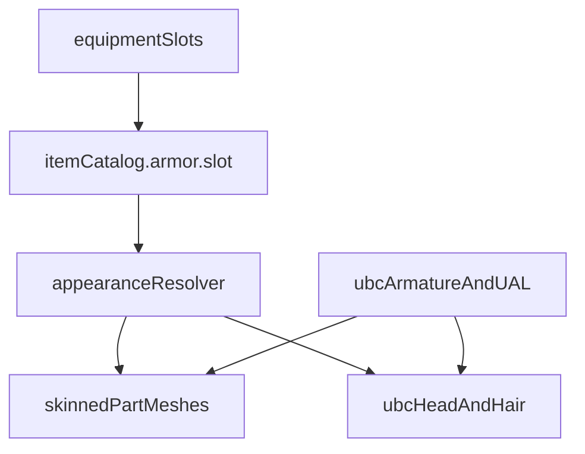

# Plan: UBC runtime per-slot outfits

**Created:** 2026-09-15
**Status:** `draft` 📝
**Priority:** medium · **Effort:** XL
**Depends on:** ~~items-player-030~~ ~~items-player-036~~
**Domain:** `items-player`
**Type:** `feature`
**Subdomains:** `presentation` `assets` `inventory`
**Tags:** `player` `characters` `equipment`
**Roadmap:** -

Draft — możliwości, braki i rekomendacje. **Nie implementować** z tego pliku, dopóki status nie zejdzie do `planned` i nie będzie decyzji o zakresie V1.

Powiązane: `items-player-030` (sloty + katalog docelowy), `033`/`034`/`036` (UBC, cały mesh ze slotu `body`). Luźny koniec: `docs/plans/LOOSE-ENDS.md` (Characters / presentation).

## Etapy

### Etap 1 — różnorodność NPC w ramach profesji

Pierwszym celem jest zwiększenie różnorodności wizualnej NPC bez mnożenia pełnych modeli GLB. Bazowy outfit nadal wynika z profesji / roli NPC (np. Peasant, Ranger), ale wariant jest składany przede wszystkim z elementów o największym wpływie wizualnym:

- `head`,
- `hair`,
- `eyes` / eyebrows,
- facial hair / beard,
- `accessories`,
- tint / wariant kolorystyczny ubrania.

Docelowy przepływ:

```text
profession / role + deterministic appearance seed
  → base outfit
  → head / hair / eyes / facial hair / accessories
  → clothing tint
  → CharacterAppearanceDefinition
```

Wariant powinien być deterministyczny i należeć do stanu NPC / świata, nie do kamery ani aktualnego renderowania. Nie tworzyć osobnego systemu equipment tylko do wizualnej różnorodności NPC.

Tint jest kluczowym mnożnikiem różnorodności. Jeden Peasant / Ranger powinien móc występować w kilku kontrolowanych paletach bez duplikowania geometrii i tekstur, o ile materiały assetu na to pozwalają.

### Etap 2 — modularność części modelu gracza

Drugim celem jest przejście z podmiany całego outfitu gracza na składanie wyglądu z części, przy zachowaniu istniejącego equipment jako źródła prawdy.

Docelowy przepływ:

```text
equipment + player appearance
  → resolvePlayerAppearance
  → modular visual parts + per-part tint
  → CharacterAppearanceDefinition
```

Priorytetowe części:

- `head`,
- `body`,
- `arms`,
- `legs`,
- `feet`,
- `hair`,
- `eyes`,
- `accessories`.

Tint gracza nie powinien docelowo pozostać jednym globalnym `playerTint`. Przy modularnym modelu potrzebna jest możliwość przypisania koloru / wariantu materiału do konkretnej części, np. `body.tint`, `arms.tint`, `legs.tint`.

NPC i gracz powinny korzystać ze wspólnej warstwy składania / renderowania modelu, ale z różnymi resolverami:

```text
NPC:    profession + seed      → CharacterAppearanceDefinition
Player: equipment + appearance → CharacterAppearanceDefinition
```

Nie tworzyć dwóch niezależnych modular-character rendererów.

## Problem

Wygląd gracza to jeden złożony GLB (`male_peasant` / `male_ranger` / `male_knight`, plus URL-only `knight_cloth` / `noble` / `wizard`). Paczka Quaternius Fantasy `[Source]` dostarcza te same outfity jako **osobne części** na wspólnym rigu UBC. Ekwipunek ma już sześć slotów, ale tylko `body` ma itemy i meshe.

Cel docelowy (gdy ten plan wejdzie w implementację): założenie hełmu, naramienników, butów itd. zmienia **odpowiedni mesh**, bez podmiany całej postaci i bez modularnego składania Arms/Body/Legs „na czuja” poza ekwipunkiem.

## Stan obecny (kod jest źródłem)

| Warstwa | Dziś |
| --- | --- |
| Resolver | `resolveEquipmentOutfit(bodyKind)` — pusty → Peasant, `leather_armor` → Ranger, inny body (w tym `chainmail`) → Knight. `?player=` whitelist wygrywa. |
| Swap | `PlayerController.applyAppearance` wymienia cały skinned `modelRoot`, rebound mixer UAL, remount `hand_r`. |
| Compose | `compose_ubc_player.py` skleja **pełny** outfit glTF + slice głowy Superhero + opcjonalnie `Hair_SimpleParted` (pomijane na Knight/Knight_Cloth). |
| Katalog | Tylko `leather_armor` i `chainmail`, oba `armor.slot: 'body'`. Brak hełmu / naramienników / rękawic / nagolennic / butów. |
| Sloty | `head` \| `body` \| `arms` \| `hands` \| `legs` \| `feet` w `equipment.ts`; UI Character Screen je pokazuje; persistencja instance id per slot. Modifiery składają się ze wszystkich założonych części — ale drugiej części nie ma. |
| NPC | Ultimate Modular Men/Women, **inny szkielet**. Nie mieszać clipów UAL z Modular. |
| Tint | `?playerTint=brown` na materiałach `MI_*` całego outfitu; nie z ekwipunku, nie w save. |

Pełne outfity Source **wewnętrznie** już są zestawem primów (np. Knight: `Body_Armor`, `Legs_Armor`, `Feet_Armor`, `Head_Armet`, pauldron, scarf) — ale lądują w jednym GLB.

## Co daje paczka

Źródło (nie ruszać layoutu `_temp/`):

```text
_temp/Models/people/Modular Character Outfits - Fantasy[Source]/
  Exports/glTF (Godot-Unreal)/Modular Parts/
```

Męskie części (żeńskie analogicznie, poza zakresem V1 jak 036):

| Klasa | Arms | Body | Legs | Feet | Head | Extra (brak slotu w 030) |
| --- | --- | --- | --- | --- | --- | --- |
| Peasant | tak | tak | tak | tak | — | — |
| Ranger | tak | tak | tak | boots | hood | pauldron |
| Knight | tak | armor **lub** cloth | armor | armor | armet **lub** horns | pauldron round/spike, scarf |
| Noble | tak | tak | tak | tak | crown | gorget, 2× pauldron |
| Wizard | tak | tak | tak | tak | — | — |

Wspólne ograniczenia paczki (README):

- Ubranie wymaga **tylko głowy** z Universal Base Characters; pełne ciało Superhero clipuje.
- Ten sam rig 65 kości co UAL1 — części można skinować na istniejącą armaturę (jak `add_skinned_mesh` w compose).
- Osobny atlas na klasę (`MI_Peasant` / `MI_Ranger` / `MI_Knight` / `MI_Noble` / `MI_Wizard`). Mix klas = kilka materiałów, nie jeden UV.
- **Brak** meshy `hands` (rękawice / gauntlety).
- Extra (pauldron, scarf, gorget, crown) nie są slotami 030.

UBC `[Standard]` nadal dostarcza głowę, oczy, brwi, fryzury (`Hair_SimpleParted`, Long, Buzzed, …).

## Mapowanie na sloty gry

Docelowy katalog 030 (12 kindów, asset-gated — **nie zrobione** poza dwoma body):

| Slot 030 | Przykład 030 | Kandydat mesh (męski) | Luka |
| --- | --- | --- | --- |
| `body` | leather / chainmail | Ranger_Body / Knight_Body_Armor (Knight_Body_Cloth jako wariant) | Peasant_Body i Wizard_Body / Noble_Body nie mają itemu |
| `head` | leather / metal helmet | Ranger_Head_Hood / Knight_Head_Armet (Horns jako wariant) | Noble crown; Peasant/Wizard bez hełmu |
| `arms` | leather / metal pauldrons | Ranger_Acc_Pauldron / Knight_Acc_Pauldron_* ; też `*_Arms` | Paczka rozdziela **rękawy** i **naramiennik**; 030 ma jeden slot `arms` |
| `hands` | leather gloves / metal gauntlets | — | **Brak assetu** |
| `legs` | leather / metal greaves | Ranger_Legs / Knight_Legs_Armor / Peasant_Legs / … | Jest mesh, nie ma itemu |
| `feet` | leather boots / metal sabatons | Ranger_Feet_Boots / Knight_Feet_Armor / Peasant_Feet / … | Jest mesh, nie ma itemu |

`hands` w V1 zostaje pusty wizualnie (gameplay modifier może kiedyś wejść bez mesha — świadoma dziura).

## Architektura (gdy implementować)

Nie tworzyć drugiego „outfit managera”. Rozszerzyć właścicieli, którzy już są:

```text
equipped slots + kinds
  → resolvePlayerAppearance (zestaw części, nie jeden id)
    → PlayerController: jeden armature UBC
         + skinned meshe per slot
         + stała głowa UBC + fryzura (z regułą hełmu)
```



**Warstwa bazowa (obowiązkowa):** puste sloty nie mogą zostawiać dziur. Rekomendacja: zawsze Peasant Arms/Body/Legs/Feet jako bielizna/odzież domyślna; założony item **zastępuje** część Peasant w tym slocie (nie dokłada drugiej warstwy — clip).

**Hełm vs włosy:** jak compose 036 — `Head_Armet` / `Head_Horns` wyłączają `Hair_SimpleParted`; hood Ranger może zostawić włosy albo je schować (do sprawdzenia w przeglądarce, nie zgadywać).

**Tint:** albo per-klasa `map` na `MI_*` części, albo rezygnacja z jednego globalnego `?playerTint=` gdy na postaci są dwa atlasy.

**Preload / perf:** części są małe względem pełnego GLB, ale liczba meshy i tekstur rośnie. Nie ładować wszystkich klas naraz. Preload: Peasant base + aktualnie noszone klasy (dziś leather→Ranger, chainmail→Knight). Unikać `gltf-transform optimize` / flatten (zniszczy skin, jak w 033).

**Save:** bez nowego pola — wygląd nadal pochodna `SavePlayerEquipment` + katalog. Tint nadal poza save, chyba że osobny plan appearance.

**Adventurer:** nadal session-lock; per-slot nie dotyczy.

**NPC:** poza zakresem. Retarget albo migracja na UBC to osobna praca.

## Możliwości (od najtańszej)

1. **Zostawić całe outfity** (036) i dodać itemy, które nadal swapują **cały** mesh (szata → Wizard, strój → Noble). Zero modularności, spójny look.
2. **Bake-time mix** w `compose_ubc_player.py` — ręcznie sklejony Peasant+hełm jako nowy preset GLB. Nadal jeden swap. Dobre na 1–2 wyjątki, złe jako szafa.
3. **Runtime per slot, jedna klasa na raz** — wszystkie części z tej samej rodziny (Peasant albo Ranger albo Knight), plus baza Peasant. Najmniej clipów i atlasów.
4. **Runtime per slot, mix klas** — Knight body + Ranger boots + Peasant legs. Technicznie ten sam rig; wizualnie kroje i atlasy się gryzą. Świadomy dług, nie V1.
5. **Runtime extra jako „akcesoria”** — scarf, gorget, lion pauldron, crown. Wymaga albo nadużycia slotu `head`/`arms`, albo nowych slotów (030 tego nie chce: bez `neck` / `waist` / left/right shoulder).

## Braki (blockery V1)

- Brak ItemKind poza dwoma `body` (030 target 12 kindów jest asset-gated i niezrealizowany).
- Brak spakowanych **części** w `public/models/` — runtime nie może czytać `_temp/`.
- Brak pipeline compose dla pojedynczej części (remap joints, tekstury, gltfpack `-kn`).
- `applyAppearance` umie tylko wymienić cały root.
- Brak meshy `hands`.
- Konflikt: jeden slot `arms` vs dwa meshe (rękaw + pauldron).
- Hełm/hood vs fryzura; Knight cloth vs armor na tym samym slocie `body`.
- Female i NPC nie są na tym rigu w runtime.
- Cross-class clipping nie jest zmierzone (brak przeglądarki na 036 w momencie draftu).

## Rekomendacje

**Nie zaczynać od (4) ani (5).** Najpierw gameplay itemów na slotach 030, potem wygląd.

Kolejność, gdy plan zejdzie z draftu:

1. **Itemy 030 dla 2–3 slotów z meshami** (np. `head` metal helmet → Armet, `feet` leather boots → Ranger boots) — nawet jeśli V1 wizualnie nadal podmienia **cały** Knight gdy jest chainmail. Inaczej modularny renderer nie ma czego słuchać.
2. **Pipeline części:** jeden GLB na `(gender, class, part)` albo jeden atlas-GLB z named nodes i hide/show — druga opcja mniej plików, trudniejszy prune. Preferować **osobne małe GLB per part**, reuse `add_skinned_mesh` + istniejący `optimize` z `prepare-ubc-player-alpha.sh`.
3. **Runtime V1 = (3):** baza Peasant + override slotów tylko w obrębie klasy itemu (leather→części Ranger, chainmail→części Knight). Pusty slot = Peasant. `hands` ignorować wizualnie.
4. **`arms`:** V1 traktować pauldron jako wygląd slotu `arms`; mesh `*_Arms` idzie z klasą `body` (rękaw zestawu), żeby nie dziurawić ramienia. Doprecyzować przy implementacji po oględzinach Armet/Hood.
5. **Wizard / Noble** zostawić jako całe outfity (036 URL albo przyszły jeden item `body`), dopóki nie ma szaty/stroju w katalogu i nie udowodniono mixu z Peasant base.
6. **Female / NPC** nie w tym planie.
7. Zapisać w implementacji: `?player=` może pinować cały preset (jak dziś) i **wyłączać** per-slot, żeby debug Adventurer/Wizard nie walczył z ekwipunkiem.

## Poza zakresem (nawet po `planned`)

- Nowe sloty ekwipunku (`neck`, `waist`, palce, tarcza).
- Quality (`common` / `good` / `masterwork`) jako osobny mesh — 030 zmienia tylko liczby.
- Persystencja tinta / character creator.
- UAL2, Mixamo, tools-007 MPFB2.
- Modular Men/Women na graczu.

## Weryfikacja (gdy będzie implementacja)

- Pusty ekwipunek = spójny Peasant, bez dziur, `hand_r` działa.
- Sam `leather_armor` na `body` = tułów Ranger, reszta Peasant (albo decyzja V1 „cały Ranger” — wtedy to nie jest ten plan).
- Hełm Knight na Peasant: włosy znikają, szyja/twarz bez clipu przez Armet.
- Unequip przywraca bazę bez reloadu świata; Continue odtwarza ten sam zestaw z save equipment.
- `?player=adventurer` nadal lock; FPS i liczba programów shaderów bez skoku przy 4–6 częściach.
- NPC bez zmian.

## Otwarte decyzje (zablokować przed `planned`)

1. V1: prawdziwy mix slotów, czy nadal cały outfit aż będą ≥2 noszone części?
2. `arms` = rękaw, pauldron, czy oba przy jednym itemie?
3. Hood Ranger: slot `head` czy część zestawu `body` leather?
4. Knight_Cloth: osobny `body` kind, czy skin/wariant kolczugi?
5. Czy baza to zawsze Peasant, także gdy gracz jest „goły” w lore?

Dopóki 1. nie jest „mix slotów”, ten plan zostaje draftem — tańszy jest dalszy rozwój 036 + katalog 030.