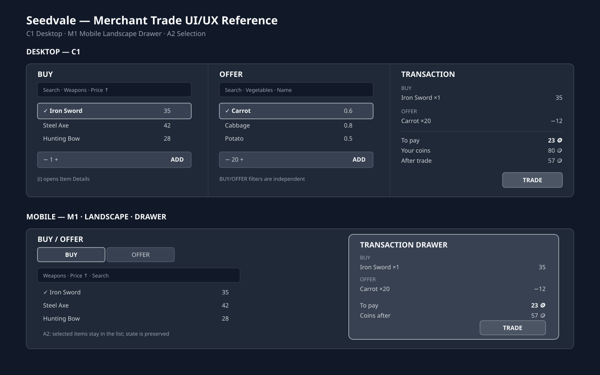
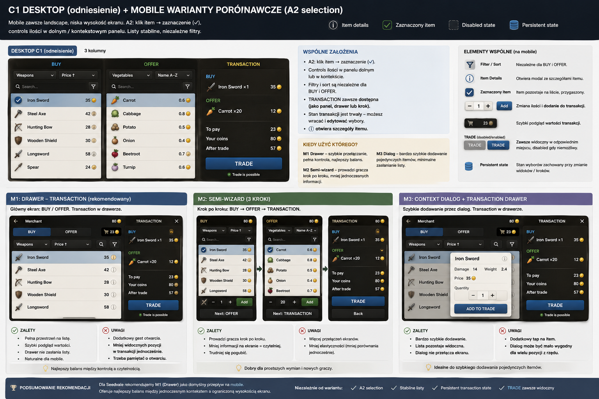
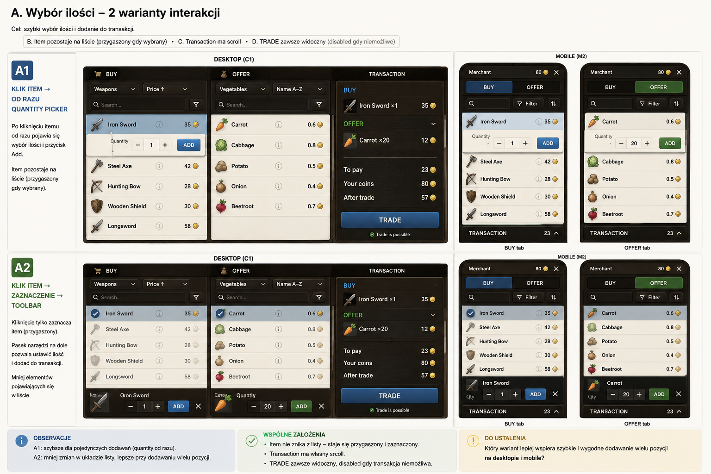

# Plan: Merchant Trade UI/UX Redesign

**Created:** 2026-08-24
**Status:** `verification needed` 🔎
**Priority:** medium · **Effort:** M
**Depends on:** none
**Domain:** ui-input

## Goal

Przeprojektować UX istniejącego ekranu handlu tak, aby był czytelny, stabilny i wygodny na desktopie oraz małych ekranach landscape.

Projekt zachowuje istniejącą logikę handlu Seedvale: buy with coins, sell, barter, merchant stock, item quantities, item instances / condition oraz inventory constraints. Nie tworzymy nowego systemu ekonomii ani nowej logiki handlu.

## UX direction

### Desktop — C1

Główny ekran składa się z trzech obszarów: `BUY`, `OFFER` i `TRANSACTION`.

BUY i OFFER są niezależnymi kontekstami. Każdy posiada własny search, filter, sort i selection state.

### Mobile — M1 Drawer

Mobile działa zawsze w landscape i ma znacznie mniejszą wysokość niż desktop. Nie próbujemy zmniejszać C1 1:1.

Główny ekran koncentruje się na jednym kontekście BUY/OFFER, natomiast TRANSACTION jest dostępna przez drawer. Stan wyboru jest zachowany przy przełączaniu kontekstów.

## Reference







Reference board przedstawia C1 Desktop, M1 Mobile Landscape Drawer oraz A2 Selection. Jest materiałem projektowym, nie źródłem implementacyjnej prawdy.

## Item selection — A2

Przyjęty wzorzec:

```text
click item
    ↓
item becomes selected
    ↓
quantity/action controls
    ↓
ADD
```

Wybrany item pozostaje na liście i jest wizualnie zaznaczony/przygaszony. Nie powodujemy przeskakiwania listy ani niepotrzebnego „mrugania” UI.

## BUY / OFFER independence

To kluczowe wymaganie. Filtr i sortowanie BUY nie mogą wpływać na OFFER.

Przykład:

```text
BUY
  Category: Weapons
  Sort: Price ↑

OFFER
  Category: Food → Vegetables
  Sort: Name
```

Stan obu kontekstów pozostaje zachowany podczas przełączania.

## Transaction

TRANSACTION jest wspólnym koszykiem całej transakcji i może jednocześnie zawierać rzeczy kupowane i oferowane.

```text
BUY
Iron Sword ×1        35

OFFER
Carrot ×20           12

────────────────────────
To pay               23
Your coins           80
After trade          57

[TRADE]
```

Jeżeli OFFER przewyższa BUY, pokazujemy `You receive`, a nie ujemne `To pay`.

Transaction state jest persistent. Zmiana filtrów, sortowania albo kontekstu nie resetuje wyborów. Transaction list ma własny scroll, a podsumowanie pozostaje poza scrollem. `TRADE` jest zawsze obecny i może być disabled.

## Item Details

Kliknięcie `(i)` otwiera osobny Item Details modal. Lista itemów pozostaje zwarta.

Modal wykorzystuje istniejące dane itemu i może pokazywać m.in. name, category/type, damage, weight, condition, capabilities, price oraz inne właściwości istotne dla danego itemu.

Nie duplikować danych ani logiki itemów w UI.

## Filtering

Filtry są niezależne dla BUY i OFFER.

### Category

Wykorzystać istniejące kategorie itemów. Można rozważyć hierarchiczne grupowanie, np. `Weapons → Melee → Swords`, oraz `Food → Vegetables`, bez wymuszania stale widocznego drzewa.

### Capabilities

Rozważyć filtrowanie według istniejących capabilities itemów, np. `Can equip`, `Can use`, `Can consume`, `Can plant`, `Can build`, `Can repair`.

Nie tworzyć nowych capabilities wyłącznie na potrzeby UI.

### Price

Zachować istniejące filtrowanie cenowe, poprawiając UX.

## Sorting

Sortowanie jest niezależne dla BUY i OFFER.

Minimum: Name, Price ascending, Price descending.

Dodatkowe kryteria, takie jak Weight, Damage lub Condition, tylko jeśli mają realną wartość i istnieją w danych itemu.

## Quantity

Quantity picker powinien obsługiwać `− / quantity / +`, respektować dostępny stock oraz ilość posiadanych itemów i pozwalać szybko wybrać większą liczbę sztuk.

Dokładna prezentacja quantity controls może zostać dopracowana podczas wireframe validation.

## Feedback

Feedback jest częścią UX i powinien wykorzystywać istniejący system feedback/toast zamiast tworzyć nowy lokalny mechanizm.

Obsłużyć m.in.:
- insufficient coins,
- insufficient item quantity,
- merchant does not buy/sell item,
- inventory capacity exceeded,
- merchant stock changed,
- price/offer changed,
- item became unavailable,
- transaction became invalid.

Komunikat powinien wyjaśniać przyczynę.

Po udanej transakcji pokazać jednoznaczny success feedback.

## World-state consistency

Merchant i jego stock są częścią żyjącego świata. Jeżeli stan zmieni się podczas otwartego Trade UI, system powinien wykryć nieaktualną ofertę, poinformować użytkownika i nie wykonać nieaktualnej transakcji.

## Stability principle

Preferować stabilny layout nad dynamiczne pojawianie się/usuwanie elementów:

- item nie znika po wyborze,
- transaction pozostaje dostępna,
- TRADE pozostaje widoczny,
- wybory nie są resetowane,
- filtry BUY/OFFER nie wpływają na siebie.

## Research conclusions

Research istniejących gier wskazał użyteczne wzorce:

- Fallout 4 / New Vegas — wspólna transakcja, kupno + sprzedaż, wyraźny bilans.
- Kingdom Come: Deliverance 2 — BUY/SELL, transaction basket, centralne podsumowanie.
- Medieval Dynasty — kategorie, quantity, weight, condition, price, item details.
- Mount & Blade II: Bannerlord — katalog, kategorie i sortowanie.
- Stardew Valley — prostota i szybkie kupowanie wielu sztuk.

Nie kopiować layoutów ani mechanik 1:1.

## Implementation approach

1. Zweryfikować obecny `MerchantScreen` i istniejące merchant/trade facades.
2. Zidentyfikować istniejące źródła prawdy dla merchant stock, inventory, filtering, sorting, capabilities, quantities, trade calculation, validation i feedback.
3. Przygotować finalny wireframe C1.
4. Przygotować finalny wireframe M1 dla landscape.
5. Zaimplementować A2 selection bez duplikowania stanu itemów.
6. Rozdzielić state BUY/OFFER dla filtrów i sortowania.
7. Zaimplementować persistent transaction view/drawer.
8. Dodać Item Details modal wykorzystujący istniejące dane itemu.
9. Uporządkować feedback i błędy wokół istniejącego systemu.
10. Usunąć tylko potwierdzone po audycie duplikacje wynikające z przebudowy Merchant UI.

Nie przebudowywać merchant/trade logic bez potrzeby.

## Verification

### Technical

- `npx tsc --noEmit`
- `pnpm run lint:fix`
- `pnpm run build`
- `pnpm run test`

### Browser / gameplay

Zweryfikować:

- C1 desktop,
- M1 landscape na małym viewport,
- BUY i OFFER z niezależnymi filtrami,
- BUY Weapons + OFFER Vegetables,
- niezależne sortowanie,
- wielokrotny wybór itemów,
- A2 selection,
- quantity changes,
- item pozostaje na liście po wyborze,
- Item Details modal,
- długi transaction list + scroll,
- persistent transaction state,
- `TRADE` zawsze widoczny,
- insufficient coins/quantity,
- inventory capacity,
- merchant stock change,
- price/offer change,
- successful barter/purchase/sell,
- Escape/back/close behaviour,
- overlay/modal/drawer stacking.

### Responsive

Sprawdzić desktop landscape, mały landscape mobile, różne proporcje landscape oraz małą wysokość viewportu.

**Zrób git commit i push do main, rebase jeżeli trzeba**
